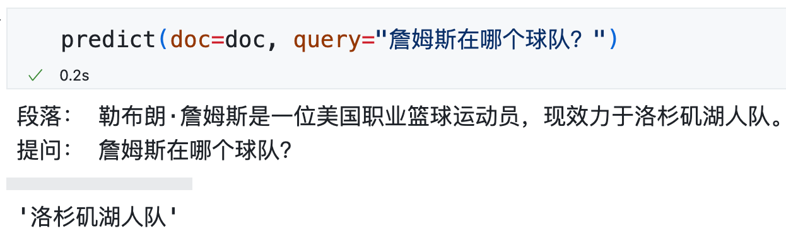
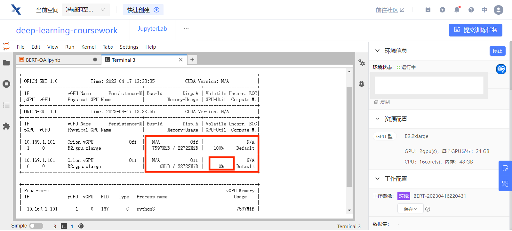
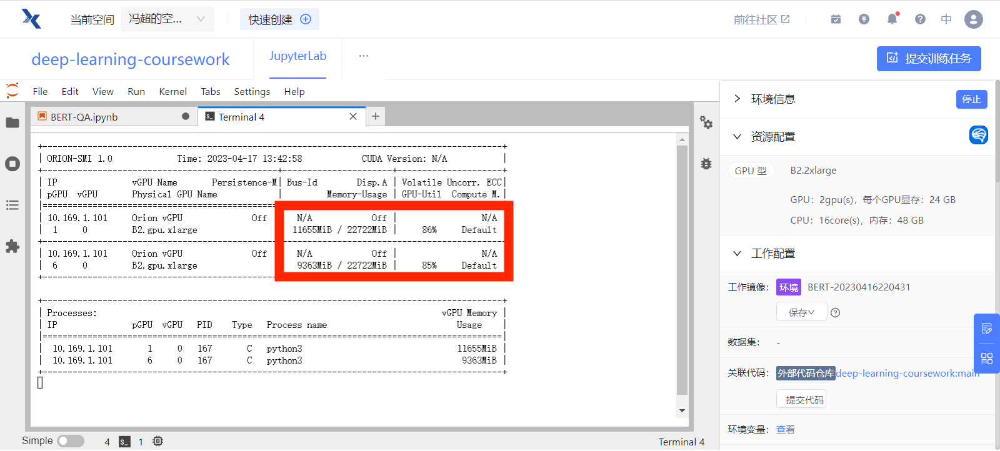
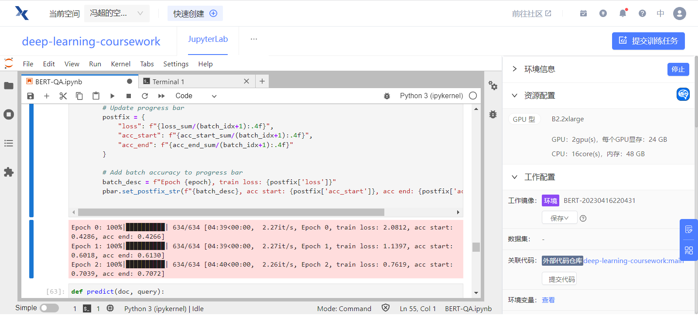
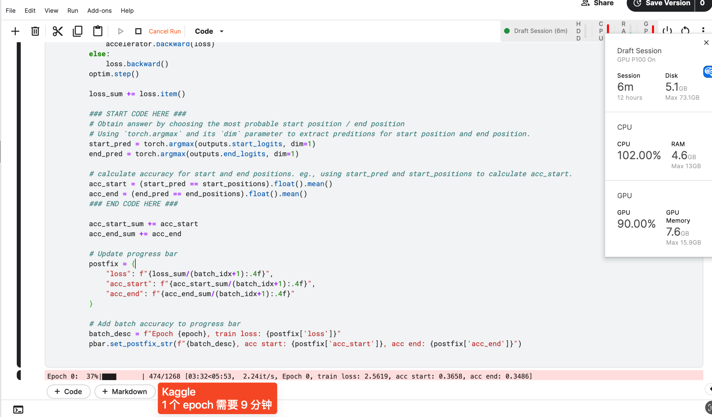
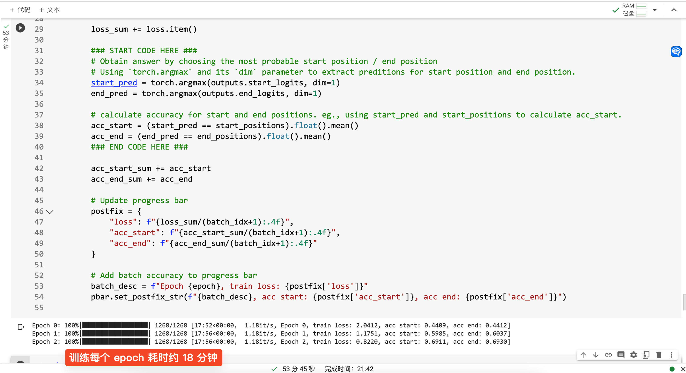
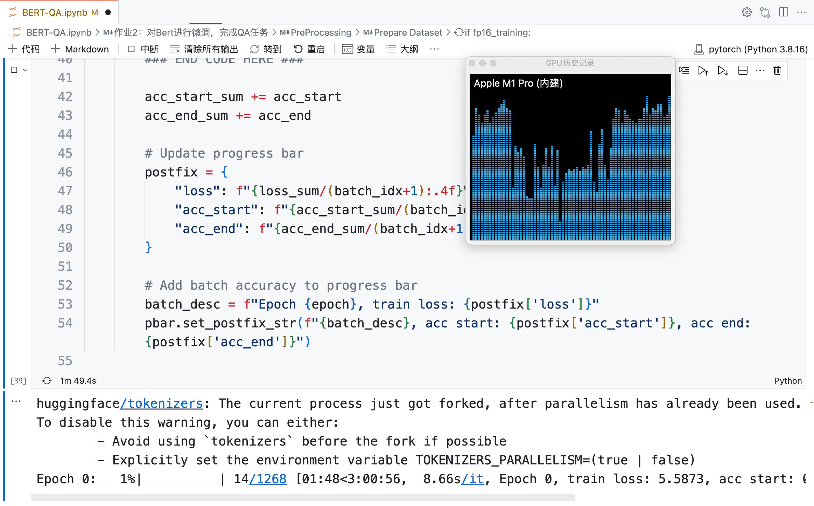

# 基于 Bert 的中文问答机器人

本文基于 Bert 的中文分词和问答的预训练模型，利用 10, 000 余条中文问答数据进行微调，构建了能够理解中文段落并回答相关问题的问答机器人。用自定义的数据进行测试，模型的效果基本能达到“正确回答小学三年级以下的阅读理解题”的水平。



这是我第一次完整地实现一个 NLP 项目。在这个过程中，我学习了如何使用预训练模型、中文分词、准备数据、文本编码与解码、设计问答机器的损失与优化目标、导出训练模型等技术，对问答领域的 NLP 有了更透彻的理解。

理论部分可参考李沐老师的 [Transformer 论文逐段精读【论文精读】](https://www.bilibili.com/video/BV1pu411o7BE) 和 [BERT 论文逐段精读【论文精读】](https://www.bilibili.com/video/BV1PL411M7eQ)。当然，如果想要理解得更透彻一些，还是应该动手写代码，看看每一步到底在做什么，到真正实现出来看到模型结果的那一刻，是非常有成就感的。

为对比不同平台上的 GPU 的训练效率的差异，我在 Kaggle、Google Colab、趋动云和本地的 Macbook Pro M1 Pro 四台机器上分别进行了训练。对于单个 Epoch：

1. 付费使用的趋动云使用 2 个 GPU 并行训练，效率最高，单个 Epoch 共耗时 4 分 40 秒；
2. 免费使用的 Kaggle 耗时 9 分钟，Google Colab 耗时 17 分钟；
3. 在 Macbook Pro M1 Pro 上运行效率最低，即使使用了 GPU，单个 Epoch 仍预计耗时 3 小时。

## 导入包

```python
import pandas as pd
import json
from tqdm.autonotebook import tqdm
import torch
import numpy as np
import random
```

## 设置在 GPU 上训练

```python
device = "cuda" if torch.cuda.is_available() else "cpu"
```

## 固定随机种子

训练过程有很多随机性，为了结果的可复现性，可以用一个函数固定住所有随机种子。

```python
def same_seeds(seed):
    torch.manual_seed(seed)
    if torch.cuda.is_available():
        torch.cuda.manual_seed(seed)
        torch.cuda.manual_seed_all(seed)
    np.random.seed(seed)
    random.seed(seed)
    torch.backends.cudnn.benchmark = False
    torch.backends.cudnn.deterministic = True
```

```python
same_seeds(0)
```

## 读取本地 Json 数据

本项目不涉及超参数的调整，因此只读取 `tarin.json` 作为训练数据，并用 `dev.json` 观察样本外的问答结果。

```python
with open("./input/cmrc2018/train.json") as f:
    train = json.load(f)

with open("./input/cmrc2018/dev.json") as f:
    dev = json.load(f)
```

## 导入预训练的分词模型和问答模型

### 安装 `transformers` 库

[huggingface](https://huggingface.co/models) 提供了许多预训练模型，可以通过 `transformers` 库导入它们。

如果没有安装 `transformers` 库，可以安装它。

```python
import importlib

try:
    importlib.import_module("transformers")
    print("transformers exists.")
except ImportError:
    ! pip install transformers
    print("transformers installed.")
```

    transformers exists.

我们需要用 `BertTokenizerFast` 导入分词模型，用 `BertForQuestionAnswering` 导入问答模型。

```python
from transformers import BertTokenizerFast, BertForQuestionAnswering
```

### 导入预训练分词模型

[`BertTokenizerFast`](https://huggingface.co/docs/transformers/model_doc/bert#transformers.BertTokenizerFast) 是 [`BertTokenizer`](https://huggingface.co/docs/transformers/model_doc/bert#transformers.BertTokenizer) 的升级版，速度更快，性能更优。

`bert-base-chinese` 是一个中文 BERT 预训练模型，可以将中文句子或文本数据转换为相应的 token，以便进行文本分类、序列标注等自然语言处理任务。

```python
tokenizer = BertTokenizerFast.from_pretrained("./pre-trained-model/bert-base-chinese")
```

### 导入预训练问答模型

```python
model = BertForQuestionAnswering.from_pretrained(
    "./pre-trained-model/bert-base-chinese"
).to(device)
# You can safely ignore the warning message (it pops up because new prediction heads for QA are initialized randomly)
```

    Some weights of the model checkpoint at ./pre-trained-model/bert-base-chinese were not used when initializing BertForQuestionAnswering: ['cls.predictions.transform.LayerNorm.weight', 'cls.predictions.bias', 'cls.predictions.decoder.weight', 'cls.predictions.transform.dense.weight', 'cls.seq_relationship.bias', 'cls.predictions.transform.dense.bias', 'cls.seq_relationship.weight', 'cls.predictions.transform.LayerNorm.bias']
    - This IS expected if you are initializing BertForQuestionAnswering from the checkpoint of a model trained on another task or with another architecture (e.g. initializing a BertForSequenceClassification model from a BertForPreTraining model).
    - This IS NOT expected if you are initializing BertForQuestionAnswering from the checkpoint of a model that you expect to be exactly identical (initializing a BertForSequenceClassification model from a BertForSequenceClassification model).
    Some weights of BertForQuestionAnswering were not initialized from the model checkpoint at ./pre-trained-model/bert-base-chinese and are newly initialized: ['qa_outputs.bias', 'qa_outputs.weight']
    You should probably TRAIN this model on a down-stream task to be able to use it for predictions and inference.

## 使用多块 GPU

在趋动云上可选择多块 GPU 的配置，但默认运行时只会使用一块 GPU，另一块 GPU 其实是空闲的。

在终端查看趋动云 GPU 使用状态：`orion-smi`



为了使用多块 GPU，我们可以将 model 输入到 `nn.DataParallel` 中，使得加载训练数据时分别并行加载到各个 GPU 上进行计算。

需要注意的是，由于损失值是在多个 GPU 上进行计算的，因此后续训练得到的 `loss.out` 是一个向量，而不是一个标量。我们后续将用 `.mean()` 对多块 GPU 上的 loss 值求均值，将其转换为一个标量。

```python
from torch import nn
from torch.nn.parallel import DataParallel

# 将模型包装在 DataParallel 中
model = nn.DataParallel(model)
```

使用多块 GPU 训练时，两个 GPU 的使用情况如下：



## 准备训练数据

原始 Json 格式的数据相当于是一个数据字典，并不是可以直接输入到神经网络中的 `tensor` 格式，我们需要将其准备为数值型的 `tensor` 数据。

```python
train["data"]
```

    [{'paragraphs': [{'id': 'TRAIN_186',
        'context': '范廷颂枢机（，），圣名保禄·若瑟（），是越南罗马天主教枢机。1963 年被任为主教；1990 年被擢升为天主教河内总教区宗座署理；1994 年被擢升为总主教，同年年底被擢升为枢机；2009 年 2 月离世。范廷颂于 1919 年 6 月 15 日在越南宁平省天主教发艳教区出生；童年时接受良好教育后，被一位越南神父带到河内继续其学业。范廷颂于 1940 年在河内大修道院完成神学学业。范廷颂于 1949 年 6 月 6 日在河内的主教座堂晋铎；及后被派到圣女小德兰孤儿院服务。1950 年代，范廷颂在河内堂区创建移民接待中心以收容到河内避战的难民。1954 年，法越战争结束，越南民主共和国建都河内，当时很多天主教神职人员逃至越南的南方，但范廷颂仍然留在河内。翌年管理圣若望小修院；惟在 1960 年因捍卫修院的自由、自治及拒绝政府在修院设政治课的要求而被捕。1963 年 4 月 5 日，教宗任命范廷颂为天主教北宁教区主教，同年 8 月 15 日就任；其牧铭为「我信天主的爱」。由于范廷颂被越南政府软禁差不多 30 年，因此他无法到所属堂区进行牧灵工作而专注研读等工作。范廷颂除了面对战争、贫困、被当局迫害天主教会等问题外，也秘密恢复修院、创建女修会团体等。1990 年，教宗若望保禄二世在同年 6 月 18 日擢升范廷颂为天主教河内总教区宗座署理以填补该教区总主教的空缺。1994 年 3 月 23 日，范廷颂被教宗若望保禄二世擢升为天主教河内总教区总主教并兼天主教谅山教区宗座署理；同年 11 月 26 日，若望保禄二世擢升范廷颂为枢机。范廷颂在 1995 年至 2001 年期间出任天主教越南主教团主席。2003 年 4 月 26 日，教宗若望保禄二世任命天主教谅山教区兼天主教高平教区吴光杰主教为天主教河内总教区署理主教；及至 2005 年 2 月 19 日，范廷颂因获批辞去总主教职务而荣休；吴光杰同日真除天主教河内总教区总主教职务。范廷颂于 2009 年 2 月 22 日清晨在河内离世，享年 89 岁；其葬礼于同月 26 日上午在天主教河内总教区总主教座堂举行。',
        'qas': [{'question': '范廷颂是什么时候被任为主教的？',
          'id': 'TRAIN_186_QUERY_0',
          'answers': [{'text': '1963 年', 'answer_start': 30}]},
         {'question': '1990 年，范廷颂担任什么职务？',
          'id': 'TRAIN_186_QUERY_1',
          'answers': [{'text': '1990 年被擢升为天主教河内总教区宗座署理', 'answer_start': 41}]},
         {'question': '范廷颂是于何时何地出生的？',
          'id': 'TRAIN_186_QUERY_2',
          'answers': [{'text': '范廷颂于 1919 年 6 月 15 日在越南宁平省天主教发艳教区出生',
            'answer_start': 97}]},
         {'question': '1994 年 3 月，范廷颂担任什么职务？',
          'id': 'TRAIN_186_QUERY_3',
          'answers': [{'text': '1994 年 3 月 23 日，范廷颂被教宗若望保禄二世擢升为天主教河内总教区总主教并兼天主教谅山教区宗座署理',
            'answer_start': 548}]},
         {'question': '范廷颂是何时去世的？',
          'id': 'TRAIN_186_QUERY_4',
          'answers': [{'text': '范廷颂于 2009 年 2 月 22 日清晨在河内离世', 'answer_start': 759}]}]}],
      'id': 'TRAIN_186',
      'title': '范廷颂'},
    ...

```python
paragraphs = [] # 存储所有段落的内容
questions = [] # 存储所有问题的内容
start_positions = [] # 存储所有答案的开始位置
end_positions = [] # 存储所有答案的结束位置
for paragraph in train["data"]: # 遍历训练数据的每个段落
    for qa in paragraph["paragraphs"][0]["qas"]: # 遍历每个段落中的所有问答
        ### START CODE HERE ###
        # 对于每个问题，将其所在段落、问题内容、答案开始位置和结束位置（计算得出）添加到相应的列表中
        paragraphs.append(paragraph["paragraphs"][0]["context"])
        questions.append(qa["question"])
        start_position = qa["answers"][0]["answer_start"]
        start_positions.append(start_position)
        answer_length = len(qa["answers"][0]["text"])
        end_positions.append(start_position + answer_length)
        ### END CODE HERE ###
```

查看前 5 个问题：

```python
questions[:5]
```

    ['范廷颂是什么时候被任为主教的？',
     '1990 年，范廷颂担任什么职务？',
     '范廷颂是于何时何地出生的？',
     '1994 年 3 月，范廷颂担任什么职务？',
     '范廷颂是何时去世的？']

查看前 5 个答案的起始位置：

```python
start_positions[:5]
```

    [30, 41, 97, 548, 759]

查看前 5 个答案的结束位置：

```python
end_positions[:5]
```

    [35, 62, 126, 598, 780]

查看第 3 个问题的回答是否正确：

```python
paragraphs[0][start_positions[2] : end_positions[2]]
```

    '范廷颂于 1919 年 6 月 15 日在越南宁平省天主教发艳教区出生'

## 对 paragraphs 和 questions 进行 Encoding

将 paragraphs 和 questions 进行 encoding。下面这段代码使用了 Hugging Face 的 tokenizer 方法，将 paragraphs 和 questions 转换成相应的 token，返回一个字典 (train_encodings) 包含这些 token 的各种信息，这些信息包括 input_ids、attention_mask 等等。return_tensors='pt' 表示返回 PyTorch 下的 tensor 格式 padding 用于填充不足 max_length 的 tokentruncation 用于在超过 max_length 时截断 token 最终的 token 长度被限制在 512 内。

参考：[https://huggingface.co/docs/transformers/main_classes/tokenizer#transformers.PreTrainedTokenizer.**call**](https://huggingface.co/docs/transformers/main_classes/tokenizer#transformers.PreTrainedTokenizer.__call__)

```python
train_encodings = tokenizer(
    paragraphs,
    questions,
    return_tensors="pt",
    padding=True,
    truncation=True,
    max_length=512,
)
```

查看 train_encodings 的 keys：

```python
train_encodings.keys()
```

    dict_keys(['input_ids', 'token_type_ids', 'attention_mask'])

- 在问答任务中，`input_ids` 是将输入文本转换为整数序列后的输出。它将每个单词或子词映射到一个唯一的整数 ID, 位于 [CLS] 和 [SEP] 标记会被分别映射到一个特殊的 ID，(101: CLS, 102: SEP)。具体可以参考下方例子。

- 在 `token_type_ids` 中，这些标记的值通常为 0 或 1，其中 0 表示该 token 属于第一个文本序列（通常是段落），1 表示该 token 属于第二个文本序列（通常是问题）。

- 在 `attention_mask` 中，0 表示对应的标记应该被忽略，1 表示对应的标记应该被关注。当输入序列长度不足最大长度时，我们需要在序列末尾填充一些无意义的标记，以使序列长度达到最大长度。在这种情况下，`tokenizer`将填充的标记的 attention mask 设置为 0，以告诉模型它们不应该被关注。

### `input_ids`

让我们来看看 `input_ids` 的具体内容，以下先向 `tokenizer` 输入一个段落和一个问题，然后查看 `input_ids` 的内容。

```python
paragraph_and_question = tokenizer(
    paragraphs[0],
    questions[0],
    return_tensors="pt",
    padding=True,
    truncation=True,
    max_length=512,
)["input_ids"][0]
```

```python
paragraph_and_question
```

    tensor([ 101, 5745, 2455, 7563, 3364, 3322, 8020, 8024, 8021, 8024, 1760, 1399,
             924, 4882,  185, 5735, 4449, 8020, 8021, 8024, 3221, 6632, 1298, 5384,
            7716, 1921,  712, 3136, 3364, 3322,  511, 9155, 2399, 6158,  818,  711,
             712, 3136, 8039, 8431, 2399, 6158, 3091, 1285,  711, 1921,  712, 3136,
            3777, 1079, 2600, 3136, 1277, 2134, 2429, 5392, 4415, 8039, 8447, 2399,
            6158, 3091, 1285,  711, 2600,  712, 3136, 8024, 1398, 2399, 2399, 2419,
            6158, 3091, 1285,  711, 3364, 3322, 8039, 8170, 2399,  123, 3299, 4895,
             686,  511, 5745, 2455, 7563,  754, 9915, 2399,  127, 3299, 8115, 3189,
            1762, 6632, 1298, 2123, 2398, 4689, 1921,  712, 3136, 1355, 5683, 3136,
            1277, 1139, 4495, 8039, 4997, 2399, 3198, 2970, 1358, 5679, 1962, 3136,
            5509, 1400, 8024, 6158,  671,  855, 6632, 1298, 4868, 4266, 2372, 1168,
            3777, 1079, 5326, 5330, 1071, 2110,  689,  511, 5745, 2455, 7563,  754,
            9211, 2399, 1762, 3777, 1079, 1920,  934, 6887, 7368, 2130, 2768, 4868,
            2110, 2110,  689,  511, 5745, 2455, 7563,  754, 8594, 2399,  127, 3299,
             127, 3189, 1762, 3777, 1079, 4638,  712, 3136, 2429, 1828, 3232, 7195,
            8039, 1350, 1400, 6158, 3836, 1168, 1760, 1957, 2207, 2548, 1065, 2109,
            1036, 7368, 3302, 1218,  511, 8707, 2399,  807, 8024, 5745, 2455, 7563,
            1762, 3777, 1079, 1828, 1277, 1158, 2456, 4919, 3696, 2970, 2521,  704,
            2552,  809, 3119, 2159, 1168, 3777, 1079, 6912, 2773, 4638, 7410, 3696,
             511, 9258, 2399, 8024, 3791, 6632, 2773,  751, 5310, 3338, 8024, 6632,
            1298, 3696,  712, 1066, 1469, 1744, 2456, 6963, 3777, 1079, 8024, 2496,
            3198, 2523, 1914, 1921,  712, 3136, 4868, 5466,  782, 1447, 6845, 5635,
            6632, 1298, 4638, 1298, 3175, 8024,  852, 5745, 2455, 7563,  793, 4197,
            4522, 1762, 3777, 1079,  511, 5422, 2399, 5052, 4415, 1760, 5735, 3307,
            2207,  934, 7368, 8039, 2668, 1762, 8779, 2399, 1728, 2932, 1310,  934,
            7368, 4638, 5632, 4507,  510, 5632, 3780, 1350, 2867, 5318, 3124, 2424,
            1762,  934, 7368, 6392, 3124, 3780, 6440, 4638, 6206, 3724, 5445, 6158,
            2936,  511, 9155, 2399,  125, 3299,  126, 3189, 8024, 3136, 2134,  818,
            1462, 5745, 2455, 7563,  711, 1921,  712, 3136, 1266, 2123, 3136, 1277,
             712, 3136, 8024, 1398, 2399,  129, 3299, 8115, 3189, 2218,  818, 8039,
            1071, 4288, 7208,  711,  519, 2769,  928, 1921,  712, 4638, 4263,  520,
             511, 4507,  754, 5745, 2455, 7563, 6158, 6632, 1298, 3124, 2424, 6763,
            4881, 2345,  679, 1914, 8114, 2399, 8024, 1728, 3634,  800, 3187, 3791,
            1168, 2792, 2247, 1828, 1277, 6822, 6121, 4288, 4130, 2339,  868, 5445,
             683, 3800, 4777, 6438, 5023, 2339,  868,  511, 5745, 2455, 7563, 7370,
             749, 7481, 2190, 2773,  751,  510, 6577, 1737,  510, 6158, 2496, 2229,
            6833, 2154, 1921,  712, 3136,  833, 5023, 7309, 7579, 1912, 8024,  738,
            4908, 2166, 2612, 1908,  934, 7368,  510, 1158, 2456, 1957,  934,  833,
            1730,  860, 5023,  511, 8431, 2399, 8024, 3136, 2134, 5735, 3307,  924,
            4882,  753,  686, 1762, 1398, 2399,  127, 3299, 8123, 3189, 3091, 1285,
            5745, 2455, 7563,  711, 1921,  712, 3136, 3777, 1079, 2600, 3136, 1277,
            2134, 2429, 5392,  102, 5745, 2455, 7563, 3221,  784,  720, 3198,  952,
            6158,  818,  711,  712, 3136, 4638, 8043,  102])

可以看到，最后一个 token 是 102，并且倒数第 2 行也有一个 102。

102 表示这是一个句子的结束标志，因此从 5745 开始应该是问题。5745 是倒数第 16 个元素，我们可以将最后 16 个元素截取出来并 decode 解码，看看是什么。

```python
tokenizer.decode(
    paragraph_and_question[-16:]
)
```

    '范 廷 颂 是 什 么 时 候 被 任 为 主 教 的 ？ [SEP]'

可以看出，最后 16 个元素确实是一个 question。

由于我们限制了 `max_length` 为 512，因此 `input_ids` 的长度为 512。paragraph 的长度可能超过 512，因此我们需要将其截断。

我们可以看看倒数第 50 到倒数第 16 个元素是什么。

```python
tokenizer.decode(
    paragraph_and_question[-50: -16]
)
```

    '， 教 宗 若 望 保 禄 二 世 在 同 年 6 月 18 日 擢 升 范 廷 颂 为 天 主 教 河 内 总 教 区 宗 座 署 [SEP]'

这确实是一个 paragraph 的一部分，但它并不是一个完整的句子。这是因为我们使用了 `truncation` 参数，paragraph 加上 question 会超过 `max_length`。完整保留 question 后，paragraph 后面的部分就被截断了。

为了验证确实是截断了 paragraph，我们可以只将 paragraph 作为输入，看看 `input_ids` 最后 50 个字符的内容。

```python
paragraph_only = tokenizer(
    paragraphs[0],
    return_tensors="pt",
    padding=True,
    truncation=True,
    max_length=512,
)["input_ids"][0]
```

```python
tokenizer.decode(
    paragraph_only[-50: ]
)
```

    '， 教 宗 若 望 保 禄 二 世 在 同 年 6 月 18 日 擢 升 范 廷 颂 为 天 主 教 河 内 总 教 区 宗 座 署 理 以 填 补 该 教 区 总 主 教 的 空 缺 。 1994 年 [SEP]'

### `token_type_ids`

`token_type_ids` 最后 16 个元素为 1，这说明最后 16 个 token 对应的是 question。

```python
train_encodings["token_type_ids"][0]
```

    tensor([0, 0, 0, 0, 0, 0, 0, 0, 0, 0, 0, 0, 0, 0, 0, 0, 0, 0, 0, 0, 0, 0, 0, 0,
            0, 0, 0, 0, 0, 0, 0, 0, 0, 0, 0, 0, 0, 0, 0, 0, 0, 0, 0, 0, 0, 0, 0, 0,
            0, 0, 0, 0, 0, 0, 0, 0, 0, 0, 0, 0, 0, 0, 0, 0, 1, 1, 1, 1, 1, 1, 1, 1,
            1, 1, 1, 1, 1, 1, 1, 1])

```python
train_encodings["token_type_ids"]
```

    tensor([[0, 0, 0,  ..., 1, 1, 1],
            [0, 0, 0,  ..., 1, 1, 1],
            ...,
            [0, 0, 0,  ..., 0, 0, 0],
            [0, 0, 0,  ..., 0, 0, 0]])

### `attention_mask`

对于那些有截断了数据，`attention_mask` 全是 1，这说明所有的 token 都是需要关注的。

```python
train_encodings["attention_mask"][0]
```

    tensor([1, 1, 1, 1, 1, 1, 1, 1, 1, 1, 1, 1, 1, 1, 1, 1, 1, 1, 1, 1, 1, 1, 1, 1,
            1, 1, 1, 1, 1, 1, 1, 1, 1, 1, 1, 1, 1, 1, 1, 1, 1, 1, 1, 1, 1, 1, 1, 1,
            1, 1, 1, 1, 1, 1, 1, 1])

对于那些没有截断的数据，`attention_mask` 最后若干个元素为 0，这说明最后一些 token 对应的是补充的 padding 数据，不需要关注。

```python
train_encodings["attention_mask"][10]
```

    tensor([1, 1, 1, 1, 1, 1, 1, 1, 1, 1, 1, 1, 1, 1, 1, 1, 1, 1, 1, 1, 1, 1, 1, 1,
            1, 1, 1, 1, 1, 1, 1, 1, 1, 1, 1, 1, 1, 1, 1, 1, 1, 1, 1, 1, 1, 1, 1, 1,
            1, 1, 1, 1, 1, 1, 1, 1, 1, 1, 1, 1, 1, 1, 1, 1, 1, 1, 1, 1, 1, 1, 0, 0,
            0, 0, 0, 0, 0, 0, 0, 0, 0, 0, 0, 0, 0, 0, 0, 0, 0, 0, 0, 0, 0, 0, 0, 0,
            0, 0, 0, 0, 0, 0, 0, 0])

长度不足 512 的文本，不会被截断，而是会被填充 0。

```python
train_encodings['input_ids'][10]
```

    tensor([ 101,  711, 3189, 3315, 4035, 4514, 6639, 4413, 2207, 2199, 5437, 4638,
             671,  702, 6235, 5682, 8024, 5632, 2207, 4266, 3678, 4895, 2460, 8024,
             680, 4266,  779,  671, 6629, 1724, 1905,  711, 2157, 8024, 3680,  702,
            1765, 3175,  738, 3221, 2521,  671,  833,  912, 4895, 2458, 8024,  852,
             800,  793, 4197, 5543, 1916,  924, 2898,  831, 4899, 4638, 2110,  689,
            2768, 5327,  511, 1762, 5018,  671, 3613, 1298, 5867, 2356, 4495, 3833,
            3198, 8024,  680, 1398, 3416, 2218, 6438,  754, 1298, 5867, 2207, 2110,
            4638, 1920, 4958, 5437,  711, 7942, 7032, 2864, 3440, 8024, 3295, 3126,
            1213, 4413, 7339, 1259, 2886, 1298, 5867, 2207, 2110,  510, 1298, 5867,
            7770,  704,  510, 3189, 3315, 2208, 2399, 7339,  510, 3189, 3315, 7471,
            2399, 1092,  510, 3189, 3315, 1952, 6817, 7339,  511, 3126, 1213, 3189,
            3315, 7471, 2399, 1092, 3309, 7313, 8024, 1728, 3131, 1398, 3678, 2460,
            4266, 4638, 1987, 1987, 2193, 5636, 6158, 6756, 3058, 5635, 3171, 5558,
            8024, 1762, 1104, 6612, 1453, 1372, 1762, 1104, 6612, 4638,  678, 1288,
            1767, 1282,  758, 1146, 7164, 2458, 1993,  677, 1767, 8024, 2768,  711,
            3189, 3315, 7339, 1932, 2533,  686, 7471, 1094, 1092, 4638, 1071,  704,
             671, 1399, 1216, 5628,  511, 1825, 3315, 6598, 3160, 5333, 1384, 8038,
            4413, 1767,  677, 4638, 5686, 3318, 2157, 1139, 6716, 1765, 8038, 3189,
            3315, 1298, 5867, 2356, 6414, 4495, 3189, 8038,  126, 3299,  126, 3189,
            3215, 2429, 8038, 7032, 4281, 2429, 4413, 6132, 1384, 4772, 8038, 8111,
            2857,  818,  855, 5390, 8038,  704, 1767,  510, 3122, 1140,  704, 1767,
             510, 1381,  704, 1767, 3078, 7270, 5558, 8038, 1381, 5558, 2792, 2247,
            7339,  824, 8038, 4669, 4506, 2255, 1383, 3125,  752, 1355, 2245, 2274,
            1922, 6947, 1762, 2207, 2110, 3309, 7313,  679, 3171, 6760, 2940, 2110,
            3413, 8024, 1762, 1298, 5867, 2207, 2110, 2218, 6438, 3198, 1762, 1059,
            1744, 1920, 6612,  704, 1932, 2533, 1094, 1092, 8039, 1744,  704,  676,
            2399, 7390, 4266,  779, 2109, 1296, 1765, 1762, 3791, 1744, 4522, 2110,
            8039, 1726, 1744, 1400,  676, 2399, 4638, 7770,  704, 4495, 3889,  671,
            4684, 6783, 5314, 3189, 3315, 4374, 4277, 2198, 2797, 3189, 1403, 2207,
            3613, 6947, 4372, 7566, 4638,  691, 6930, 2110, 7368,  511, 1762,  523,
             100, 8133,  524, 2399,  807, 8024, 1920, 4958, 5437,  510, 3189, 1403,
            2207, 3613, 6947, 5023, 1399, 2199, 1772, 6760, 2773, 3862, 1912, 8024,
             800,  680, 3351, 2255, 1045,  510,  676, 3329, 3919, 5299, 2768,  749,
             519,  100,  520, 5299, 1394, 8020, 3351, 2255, 1045,  100,  100,  510,
            2274, 1922, 6947,  100,  100,  510,  676, 3329, 3919,  100,  100, 8021,
             511, 2553, 3324, 2825,  122,  119, 1726, 1213, 1143, 2198, 7305,  123,
             119,  100,  119,  100,  119,  100,  119, 2198, 7305,  124,  119, 1352,
             782, 2198, 7305,  113,  680, 1920, 4958, 5437, 1394,  868,  114,  102,
            3189, 3315, 7339, 1932, 2533,  686, 7471, 1094, 1092, 8024, 2274, 1922,
            6947, 1355, 2916,  749,  784,  720,  868, 4500, 8043,  102,    0,    0,
               0,    0,    0,    0,    0,    0,    0,    0,    0,    0,    0,    0,
               0,    0,    0,    0,    0,    0,    0,    0])

```python
tokenizer.decode(
    tokenizer(
        paragraphs[10],
        questions[10],
        return_tensors="pt",
        padding=True,
        truncation=True,
        max_length=512,
    )["input_ids"][0]
)
```

    '[CLS] 为 日 本 漫 画 足 球 小 将 翼 的 一 个 角 色 ， 自 小 父 母 离 异 ， 与 父 亲 一 起 四 处 为 家 ， 每 个 地 方 也 是 待 一 会 便 离 开 ， 但 他 仍 然 能 够 保 持 优 秀 的 学 业 成 绩 。 在 第 一 次 南 葛 市 生 活 时 ， 与 同 样 就 读 于 南 葛 小 学 的 大 空 翼 为 黄 金 拍 档 ， 曾 效 力 球 队 包 括 南 葛 小 学 、 南 葛 高 中 、 日 本 少 年 队 、 日 本 青 年 军 、 日 本 奥 运 队 。 效 力 日 本 青 年 军 期 间 ， 因 救 同 母 异 父 的 妹 妹 导 致 被 车 撞 至 断 脚 ， 在 决 赛 周 只 在 决 赛 的 下 半 场 十 五 分 钟 开 始 上 场 ， 成 为 日 本 队 夺 得 世 青 冠 军 的 其 中 一 名 功 臣 。 基 本 资 料 绰 号 ： 球 场 上 的 艺 术 家 出 身 地 ： 日 本 南 葛 市 诞 生 日 ： 5 月 5 日 星 座 ： 金 牛 座 球 衣 号 码 ： 11 担 任 位 置 ： 中 场 、 攻 击 中 场 、 右 中 场 擅 长 脚 ： 右 脚 所 属 队 伍 ： 盘 田 山 叶 故 事 发 展 岬 太 郎 在 小 学 期 间 不 断 转 换 学 校 ， 在 南 葛 小 学 就 读 时 在 全 国 大 赛 中 夺 得 冠 军 ； 国 中 三 年 随 父 亲 孤 单 地 在 法 国 留 学 ； 回 国 后 三 年 的 高 中 生 涯 一 直 输 给 日 本 王 牌 射 手 日 向 小 次 郎 率 领 的 东 邦 学 院 。 在 【 [UNK] 23 】 年 代 ， 大 空 翼 、 日 向 小 次 郎 等 名 将 均 转 战 海 外 ， 他 与 松 山 光 、 三 杉 淳 组 成 了 「 [UNK] 」 组 合 （ 松 山 光 [UNK] [UNK] 、 岬 太 郎 [UNK] [UNK] 、 三 杉 淳 [UNK] [UNK] ） 。 必 杀 技 1. 回 力 刀 射 门 2. [UNK]. [UNK]. [UNK]. 射 门 3. 双 人 射 门 ( 与 大 空 翼 合 作 ) [SEP] 日 本 队 夺 得 世 青 冠 军 ， 岬 太 郎 发 挥 了 什 么 作 用 ？ [SEP]'

### 查看 `input_ids`、`token_type_ids` 和 `attention_mask` 的维度：

```python
print(train_encodings["input_ids"].shape)
print(train_encodings["token_type_ids"].shape)
print(train_encodings["attention_mask"].shape)
```

    torch.Size([10142, 512])

## 将 answer 在原始 paragrapgh 的起止索引，转换为：在经过 tokenizor 之后的 input_ids 中的起止索引

原始的起止索引是单个字符的索引。例如：

- paragrapgh: `我出生于 2001 年。`

- question: `我出生于哪一年？`

- answer: `2001 年。`

这句话的 `2001` 的 `start_index` 是 4，`end_index` 是 7。

但是，经过 tokenizer 之后，`2001` 被识别成了 1 个 token。因此 `start_index` 是 4，`end_index` 也是 4。

```python
# `char_to_token` will convert answer's start/end positions in paragraph_text to start/end positions in tokenized_paragraph
train_encodings["start_positions"] = torch.tensor(
    [
        train_encodings.char_to_token(idx, x)
        if train_encodings.char_to_token(idx, x) != None
        else -1
        for idx, x in enumerate(start_positions)
    ]
)
train_encodings["end_positions"] = torch.tensor(
    [
        train_encodings.char_to_token(idx, x - 1)
        if train_encodings.char_to_token(idx, x - 1) != None
        else -1
        for idx, x in enumerate(end_positions)
    ]
)

```

```python
train_encodings["start_positions"]
```

    tensor([ 31,  39,  86,  ..., 142, 225,  17])

```python
train_encodings["end_positions"]
```

    tensor([ 32,  56, 110,  ..., 143, 244,  19])

以第 3 个问题为例，即以 86 和 110 作为起止索引为例，查看它们对应的字符串是什么：

```python
questions[2]
```

    '范廷颂是于何时何地出生的？'

```python
print("answer 在原始字符串中的起止索引为：", start_positions[2], end_positions[2])
```

    answer 在原始字符串中的起止索引为： 97 126

```python
paragraphs[0][start_positions[2] : end_positions[2]]
```

    '范廷颂于 1919 年 6 月 15 日在越南宁平省天主教发艳教区出生'

```python
tokenizer.decode(train_encodings["input_ids"][0][86 : 110 + 1])
```

    '范 廷 颂 于 1919 年 6 月 15 日 在 越 南 宁 平 省 天 主 教 发 艳 教 区 出 生'

可以看出，answer 在原始字符串中的 start_position 为 97，但在经过 tokenizer 之后，start_position 变成了 86。

## 加载训练数据

```python
import torch
from torch.utils.data import Dataset, DataLoader, TensorDataset

class SquadDataset(torch.utils.data.Dataset):
    def __init__(self, encodings):
        self.encodings = encodings

    def __getitem__(self, idx):
        return {k: v[idx].to(device) for k, v in self.encodings.items()}

    def __len__(self):
        return len(self.encodings.input_ids)

train_dataset = SquadDataset(train_encodings)

```

## 指定 optimizer 为 AdamW

```python
from torch.optim import AdamW

train_loader = DataLoader(train_dataset, batch_size=16, shuffle=True)

### START CODE HERE ###
# Use AdamW as the optimizer, and learning rate 5e-5.
# https://pytorch.org/docs/stable/generated/torch.optim.AdamW.html
optim = torch.optim.AdamW(model.parameters(), lr=5e-5)
### END CODE HERE ###
```

## 加速训练

Automatic Mixed Precision (AMP) is available on NVIDIA GPUs that support Tensor Cores, which are specialized hardware units for performing fast matrix multiplication and convolution operations in deep learning. Specifically, Tensor Cores are available on NVIDIA Volta, Turing, and Ampere architectures, which include the following GPU series:

- Volta: Tesla V100, Titan V
- Turing: Quadro RTX, GeForce RTX 20-series, Titan RTX
- Ampere: A100, GeForce RTX 30-series, Titan RTX

由于 Macbook Pro 不支持 Tensor Cores，因此无法使用 AMP。我们将下面的代码注释掉。

```python
# # Change "fp16_training" to True to support automatic mixed precision training (fp16)
# fp16_training = True

# if fp16_training:
#     try:
#         importlib.import_module("accelerate")
#         print("accelerate exists.")
#     except ImportError:
#         ! pip install accelerate
#         print("accelerate installed.")
#     from accelerate import Accelerator

#     accelerator = Accelerator()
#     device = accelerator.device

# # Documentation for the toolkit:  https://huggingface.co/docs/accelerate/
```

```python
# model, optim, train_loader = accelerator.prepare(model, optim, train_loader)
```

## 训练模型

### 测试一下，训练 1 个 batch 时究竟在做什么

```python
model.train()
loss_sum = 0.0
acc_start_sum = 0.0
acc_end_sum = 0.0
```

```python
# 只加载一个 batch 的数据
for batch_idx, batch in enumerate(tqdm(train_loader)):
    print(batch_idx, batch)
    break

```

    huggingface/tokenizers: The current process just got forked, after parallelism has already been used. Disabling parallelism to avoid deadlocks...
    To disable this warning, you can either:
    	- Avoid using `tokenizers` before the fork if possible
    	- Explicitly set the environment variable TOKENIZERS_PARALLELISM=(true | false)
    
      0%|          | 0/634 [00:00<?, ?it/s]
    
    0 {'input_ids': tensor([[ 101, 1102, 3777,  ...,    0,    0,    0],
            [ 101, 6437, 1923,  ...,    0,    0,    0],
            [ 101, 4549, 4565,  ..., 4638, 8043,  102],
            ...,
            [ 101, 6205, 2335,  ...,    0,    0,    0],
            [ 101,  517, 4263,  ..., 4638, 8043,  102],
            [ 101, 7942, 7583,  ...,    0,    0,    0]]), 'token_type_ids': tensor([[0, 0, 0,  ..., 0, 0, 0],
            [0, 0, 0,  ..., 0, 0, 0],
            [0, 0, 0,  ..., 1, 1, 1],
            ...,
            [0, 0, 0,  ..., 0, 0, 0],
            [0, 0, 0,  ..., 1, 1, 1],
            [0, 0, 0,  ..., 0, 0, 0]]), 'attention_mask': tensor([[1, 1, 1,  ..., 0, 0, 0],
            [1, 1, 1,  ..., 0, 0, 0],
            [1, 1, 1,  ..., 1, 1, 1],
            ...,
            [1, 1, 1,  ..., 0, 0, 0],
            [1, 1, 1,  ..., 1, 1, 1],
            [1, 1, 1,  ..., 0, 0, 0]]), 'start_positions': tensor([ 38, 108,  19,  81,  10, 330, 204,  12, 170,  44, 246, 473, 263,   8,
             37, 270]), 'end_positions': tensor([ 47, 131,  20,  86,  17, 346, 240,  22, 175,  55, 254, 478, 292,  28,
             51, 293])}

```python
batch_idx
```

    0

由于 train_loader 设置了 `batch_size=16`，因此这里每一个批次包含 16 个数据

```python
batch['input_ids'].shape
```

    torch.Size([16, 512])

下面一共有 16 行、512 列的数据，每一行对应一个样本，每一列对应一个 token。

- 每一行的第一个 token 是 101，对应的是 [CLS]；
- 有些行的最后一个 token 是 102，对应的是 [SEP]，说明这一行是一个句子的结束，并且很可能是由于太长而被截断的；
- 有些行的最后一个 token 是 0，对应的是 padding，说明这一行是由于不足 512 个 token 而被填充的。

```python
batch['input_ids']
```

    tensor([[ 101, 1102, 3777,  ...,    0,    0,    0],
            [ 101, 6437, 1923,  ...,    0,    0,    0],
            [ 101, 4549, 4565,  ..., 4638, 8043,  102],
            ...,
            [ 101, 6205, 2335,  ...,    0,    0,    0],
            [ 101,  517, 4263,  ..., 4638, 8043,  102],
            [ 101, 7942, 7583,  ...,    0,    0,    0]])

将梯度清零，然后将数据输入到模型中，得到输出。

```python
optim.zero_grad()
```

```python
input_ids = batch["input_ids"]
attention_mask = batch["attention_mask"]
start_positions = batch["start_positions"]
end_positions = batch["end_positions"]

outputs = model(
    input_ids,
    attention_mask=attention_mask,
    start_positions=start_positions,
    end_positions=end_positions,
)
```

output 包含 3 个元素，分别是：

- `loss`：模型的 loss，若在单个 GPU 上训练，则它是一个标量；若在多个 GPU 上训练，则它是一个向量，我们需要将它求平均，得到一个标量。
- `start_logits`：模型预测的 answer 的起始位置的 logits，它的维度为 `[batch_size, sequence_length]`。我们需要找到每个样本中最大的 logits 的索引，这个位置最有可能是 answer 的起始位置。
- `end_logits`：模型预测的 answer 的结束位置的 logits，它的维度为 `[batch_size, sequence_length]`。我们需要找到每个样本中最大的 logits 的索引，这个位置最有可能是 answer 的结束位置。

```python
outputs
```

    QuestionAnsweringModelOutput(loss=tensor(6.3551, grad_fn=<DivBackward0>), start_logits=tensor([[ 0.2125, -0.0176,  0.8175,  ..., -0.0908,  0.1679, -0.0031],
            [-0.2033, -0.3505,  0.3795,  ..., -0.2303, -0.0989, -0.2526],
            [-0.1405, -0.2148,  0.3679,  ...,  0.4882,  0.4927,  0.1160],
            ...,
            [ 0.3012, -0.1959,  0.4851,  ...,  0.1459,  0.0050,  0.0071],
            [ 0.4969,  0.1853,  0.6557,  ...,  1.1007,  0.5564,  0.6131],
            [ 0.7602, -0.2658,  0.1790,  ...,  0.0998, -0.0900, -0.1103]],
           grad_fn=<CloneBackward0>), end_logits=tensor([[ 0.5864,  0.2094, -0.2350,  ...,  0.0376, -0.0851,  0.1369],
            [ 0.6591,  0.6336, -0.3106,  ..., -0.1314,  0.0859,  0.2088],
            [ 0.4751,  0.4456, -0.7501,  ..., -0.4076,  0.6677,  0.2978],
            ...,
            [ 0.2938,  0.6359,  0.2300,  ..., -0.1223, -0.0624,  0.0244],
            [ 0.5656, -0.0421, -0.4359,  ..., -0.3173,  0.4669, -0.0290],
            [ 0.5795,  0.6293,  0.0137,  ..., -0.2818, -0.0483,  0.1549]],
           grad_fn=<CloneBackward0>), hidden_states=None, attentions=None)

```python
loss = outputs.loss.mean()
```

```python
loss
```

    tensor(6.3551, grad_fn=<MeanBackward0>)

```python
# accelerator.backward(loss)
```

将 loss 反向传播，然后更新模型参数：

```python
optim.step()
```

将 loss 值进行累加：

```python
loss_sum += loss.item()
```

对于第一个问答，输出每个 token 作为 start 的 logit，其值越大，说明越有可能作为 start

```python
outputs.start_logits[0]
```

    tensor([ 0.2125, -0.0176,  0.8175,  0.1401,  0.3830,  0.5447,  0.2535,  0.5441,
             0.4506,  0.1667, -0.0406,  0.2431,  0.5296,  0.5443,  0.1391,  0.5039,
             0.5513,  0.3531, -0.0036,  0.5418,  0.3638,  0.8562,  0.7709,  0.4136,
            -0.1002,  0.3804,  0.5228, -0.3767,  0.8535, -0.4170, -0.2852,  0.2198,
            -0.0988,  0.2945,  0.2500,  0.5346,  0.2510,  0.3977,  0.1791, -0.1008,
            -0.1827,  0.8526,  0.0159, -0.1219, -0.2111, -0.4803,  0.0551, -0.0085,
             0.3079,  0.2909,  0.7248,  0.1219,  0.2148,  0.4679,  0.6030, -0.0318,
            -0.4633, -0.4084, -0.0116,  0.1284,  0.1204,  0.2487, -0.5812, -0.2066,
             0.2473,  0.0449, -0.2151,  0.6374,  0.2120,  0.3509,  0.0443, -0.5371,
             0.3848,  0.2174,  0.3050,  0.4796,  0.4882,  0.4878,  0.2726,  1.0422,
             0.3216, -0.4328, -0.4191, -0.0842, -0.2140, -0.1477, -0.1366,  0.6466,
             0.3154,  0.2114,  0.1608,  0.2045, -0.0919,  0.4392, -0.0932,  0.0259,
             0.5206,  0.5873,  0.1224,  0.0170, -0.2463, -0.0985, -0.4752, -0.0680,
            -0.0785,  0.1700,  0.4130, -0.6297, -0.5192,  0.3324, -0.1612,  0.8141,
             0.7047, -0.0652, -0.6879,  0.4414,  0.9682, -0.4101, -0.3696,  0.0626,
             0.7201,  0.1437, -0.1224,  0.4853,  0.4180,  0.6894, -0.0080,  0.4638,
             0.3224,  0.3924,  0.5430, -0.3150,  0.1130,  0.3327,  0.9553,  0.1766,
            -0.1214, -0.0748,  0.2101, -0.2757, -0.3623, -0.2271,  0.7705,  0.2296,
             0.4204,  0.2503, -0.1333, -0.6823, -0.3707, -0.4157, -0.5318,  0.2350,
             0.0367, -0.4597, -0.2335, -0.0836,  0.0926, -0.5748, -0.4118, -0.3472,
            -0.3903,  0.1274,  0.0093,  0.3531,  0.0752, -0.3509, -0.0047, -0.4949,
            -0.3875, -0.1310,  0.1725,  0.1557, -0.2232,  0.7752,  0.4941,  0.7711,
             0.5737,  0.0653,  0.2567,  0.2475,  0.6255,  0.1423,  0.4833,  0.1594,
            -0.3646,  0.1656,  0.6454,  0.5056,  0.1226,  0.3239,  0.1266, -0.1670,
             0.5881,  0.2466,  0.5619,  0.3316,  1.0385,  0.5894,  0.7943,  0.2949,
             0.2460,  0.1228,  0.2602,  0.5001,  0.3455,  0.0215,  0.0672,  0.3724,
             0.5243,  0.0491,  0.4194, -0.0477,  0.3131,  0.2198,  0.1860, -0.0031,
            -0.5847, -0.6715, -0.0939,  0.0574,  0.6994,  0.8004,  0.0661, -0.2464,
             0.2083, -0.3359, -0.0455,  0.3431,  0.5009,  0.3378,  0.0871,  0.4479,
             0.8333, -0.1767,  0.2192,  0.2366, -0.0889, -0.7379, -0.7137, -0.2394,
             0.2897, -0.1432,  0.2697, -1.0396,  0.1074, -0.0957, -0.1519,  0.2058,
            -0.7276, -0.6365,  0.1310,  0.0410,  0.0610,  0.2857,  0.1487,  0.2475,
            -0.3950,  0.2993,  0.3038,  0.4302,  0.5475,  0.4055,  0.4028,  0.3937,
             0.4151,  0.2934, -0.4341,  0.1555, -0.0497,  0.3891,  0.4310,  0.3350,
             0.2426,  0.3268, -0.1807,  0.2414,  0.5263,  0.4906,  0.0672,  0.4079,
             0.5031,  0.4021,  0.5126,  0.3123,  0.5452,  0.4220,  0.2336,  0.6535,
             0.1540,  0.4732,  0.8249,  0.1131,  0.4821,  0.7310,  0.3041,  0.2527,
             0.4379,  0.2597,  0.1327,  0.9209, -0.1255,  0.5664,  0.0277,  0.4685,
             0.3919,  0.3305, -0.1136,  0.6584,  1.1735,  0.2455,  0.3451,  0.1770,
             0.1515,  0.5662,  0.8513,  0.5403, -0.4512, -0.3062,  0.2060,  0.3442,
             0.2045,  0.7849,  0.3150, -0.0569, -0.2507,  0.1957, -0.0929, -0.1571,
             0.2783,  0.3085,  0.0191,  0.1233,  0.0252,  0.4742,  0.6263,  0.3042,
             0.6639,  0.5058, -0.1975,  0.1259,  0.4177,  0.1303,  0.5247,  0.2499,
            -0.0815, -0.0282,  0.4332,  0.1094,  0.4963, -0.1465,  0.1582, -0.4715,
            -0.5223,  0.1088,  0.3296,  0.5983,  0.1077, -0.2420, -0.7281,  0.3860,
             0.4557,  0.3288,  0.6238,  0.2216,  0.4434,  0.0476,  0.0969,  0.3931,
             0.8894,  0.1470,  0.9491,  0.2486,  0.2623,  0.0245, -0.1257,  0.0433,
             0.6014,  0.3871,  0.4724,  0.3186,  0.1811, -0.2717,  0.6531, -0.0603,
            -0.4586, -0.3631, -0.5564, -0.0339, -0.2336, -0.2790,  0.2397, -0.0855,
             0.0136,  0.3702,  0.0660,  0.4432,  0.1387,  0.2210,  0.7574,  0.0257,
             0.6028, -0.5347,  0.1119,  0.4418, -0.0884,  0.4299, -0.1921,  0.1301,
            -0.2481, -0.4902, -0.1519, -0.1551,  0.0304,  0.0186,  0.2762, -0.2509,
             0.0596,  0.1861,  0.0098,  0.3545,  0.0227,  0.3228,  0.0400,  0.3991,
             0.1981, -0.3654, -0.3493,  0.4351,  0.1579,  1.1858,  0.2790,  0.6369,
             0.1570, -0.0068,  0.5205,  0.8042, -0.2005,  0.1072,  0.3860, -0.4949,
            -0.8076,  0.2753,  0.4907, -0.0517, -0.3666,  0.9987,  0.6335,  0.2978,
             0.1904, -0.0268,  0.1084, -0.1994,  0.0377, -0.1858,  0.7314,  0.1077,
             0.4524, -0.3251,  0.2856,  0.4970,  0.6726,  0.4166,  0.1171,  0.3717,
             0.4084,  0.2922,  0.2872,  0.4913,  0.2816,  0.6087,  0.8251,  0.2142,
            -0.0854,  0.7196,  0.6450,  0.4110,  0.3252,  0.4044,  0.4999,  0.4911,
             0.2375,  0.3400,  0.1322,  0.1493,  0.0513, -0.0023,  0.1486,  0.0358,
             0.2667, -0.0037,  0.5133,  0.3341,  0.4385,  0.2358,  0.4318, -0.0516,
             0.0674,  0.2064,  0.2652, -0.0804,  0.0899,  0.0967,  0.0405, -0.0277,
             0.0649,  0.0952,  0.0291,  0.1091,  0.0682, -0.0908,  0.1679, -0.0031],
           grad_fn=<SelectBackward0>)

以下结果说明，第 4 个问答中，第 310 个 token 最有可能是 start

```python
torch.argmax(outputs.start_logits, dim=1)
```

    tensor([429, 343,  23, 310,   9, 323, 342,  12, 230, 315, 217,  47, 301,  39,
            491,  30])

```python
start_pred = torch.argmax(outputs.start_logits, dim=1)
end_pred = torch.argmax(outputs.end_logits, dim=1)
```

```python
start_pred
```

    tensor([429, 343,  23, 310,   9, 323, 342,  12, 230, 315, 217,  47, 301,  39,
            491,  30])

```python
end_pred
```

    tensor([116,  15, 510, 104,   0,   0,  64, 293, 138,  78, 165,   0,   0, 185,
             13, 217])

### 用所有数据训练模型

训练过程的关键步骤为：

1. 将梯度清零。
2. 将数据输入到模型中，得到输出。
3. 将 loss 反向传播，然后更新模型参数。这里的 loss 的计算逻辑是：判断模型预测的 start 和 end 的位置是否与真实的 start 和 end 的位置相同，若相同，则 loss 为 0，否则 loss 为 1。这类似于多分类问题，我们可以打印出分类的 accuracy，也就是有多少个起始位置和结束位置都被预测正确了。
4. 将 loss 值进行累加。

我们使用 tqdm 来显示训练的进度，并动态地显示 loss 和 accuracy 的值。

我在 Kaggle、Google Colab、趋动云和本地的 Macbook Pro M1 Pro 四台机器上分别进行了训练。对于单个 Epoch：

1. 付费使用的趋动云使用 2 个 GPU 并行训练，效率最高，单个 Epoch 共耗时 4 分 40 秒；



2. 免费使用的 Kaggle 耗时 9 分钟，Google Colab 耗时 17 分钟；





3. 在 Macbook Pro M1 Pro 上运行效率最低，即使使用了 GPU，单个 Epoch 仍预计耗时 3 小时。



```python
# if fp16_training:
#     model, optim, train_loader = accelerator.prepare(model, optim, train_loader)

model.train()
for epoch in range(3):
    loss_sum = 0.0
    acc_start_sum = 0.0
    acc_end_sum = 0.0
    pbar = tqdm(train_loader, desc=f"Epoch {epoch}")
    for batch_idx, batch in enumerate(pbar):
        optim.zero_grad()

        input_ids = batch["input_ids"]
        attention_mask = batch["attention_mask"]
        start_positions = batch["start_positions"]
        end_positions = batch["end_positions"]

        outputs = model(
            input_ids,
            attention_mask=attention_mask,
            start_positions=start_positions,
            end_positions=end_positions,
        )
        # 需要注意的是，由于损失值是在多个 GPU 上进行计算的，因此得到的 `loss.out` 是一个向量，而不是一个标量。我们可以用 .mean() 对多块 GPU 上的 loss 值求均值，将其转换为一个标量
        loss = outputs.loss.mean()
        # if fp16_training:
        #     accelerator.backward(loss)
        # else:
        loss.backward()
        optim.step()

        loss_sum += loss.item()

        ### START CODE HERE ###
        # Obtain answer by choosing the most probable start position / end position
        # Using `torch.argmax` and its `dim` parameter to extract preditions for start position and end position.
        start_pred = torch.argmax(outputs.start_logits, dim=1)
        end_pred = torch.argmax(outputs.end_logits, dim=1)

        # calculate accuracy for start and end positions. eg., using start_pred and start_positions to calculate acc_start.
        acc_start = (start_pred == start_positions).float().mean()
        acc_end = (end_pred == end_positions).float().mean()
        ### END CODE HERE ###

        acc_start_sum += acc_start
        acc_end_sum += acc_end

        # Update progress bar
        postfix = {
            "loss": f"{loss_sum/(batch_idx+1):.4f}",
            "acc_start": f"{acc_start_sum/(batch_idx+1):.4f}",
            "acc_end": f"{acc_end_sum/(batch_idx+1):.4f}",
        }

        # Add batch accuracy to progress bar
        batch_desc = f"Epoch {epoch}, train loss: {postfix['loss']}"
        pbar.set_postfix_str(
            f"{batch_desc}, acc start: {postfix['acc_start']}, acc end: {postfix['acc_end']}"
        )
```

## 将训练好的模型保存到本地

训练过程十分耗时，因此我们将训练好的模型保存到本地，以便后续直接调用。

注意，使用单 GPU 和使用多 GPU 训练的模型，保存的方式是不同的。

- 对于单 GPU 训练的模型，直接用 `.save_pretrained()` 方法保存即可；
- 对于多 GPU 训练的模型，需要先用 `.module` 属性取出模型，然后再用 `.save_pretrained()` 方法保存。

```python
# 对于单 GPU 训练的模型，直接用 .save_pretrained()
# model.save_pretrained("./fengchao-bert-qa", from_pt=True)
# 对于多 GPU 训练得到的模型，要加上 .module
model.module.save_pretrained("./fengchao-bert-qa", from_pt=True)
```

## 读取本地训练好的模型

```python
model = BertForQuestionAnswering.from_pretrained(
    "./fengchao-bert-qa"
).to(device)
```

## 在新的数据集上进行预测（最激动人心的部分）

```python
# 定义一个名为 predict 的函数，接收两个参数 doc 和 query
def predict(doc, query):
    # 输出“段落：”和  doc 的内容
    print("段落：", doc)
    # 输出“提问：”和 query 的内容
    print("提问：", query)
    # 将 doc 和 query 传递给 tokenizer 函数，将返回结果赋值给 item
    item = tokenizer(
        [doc, query], max_length=512, return_tensors="pt", truncation=True, padding=True
    )
    # 关闭 torch 的梯度计算
    with torch.no_grad():
        # 将 input_ids 和 attention_mask 传递给 model，将返回结果赋值给 outputs
        input_ids = item["input_ids"].to(device).reshape(1, -1)
        attention_mask = item["attention_mask"].to(device).reshape(1, -1)

        outputs = model(input_ids[:, :512], attention_mask[:, :512])

        ### START CODE HERE ###
        # 使用`torch.argmax`和它的`dim`参数来提取开始位置和结束位置的预测结果
        start_pred = torch.argmax(outputs.start_logits, dim=1)
        end_pred = torch.argmax(outputs.end_logits, dim=1)
        ### END CODE HERE ###

    # 将预测结果转为字符级别
    try:
        start_pred = item.token_to_chars(0, start_pred)
        end_pred = item.token_to_chars(0, end_pred)
    except:
        # 如果出现异常，则返回“无法找到答案”
        return "无法找到答案"

    # 判断结果是否有效，如果有效则返回结果
    if start_pred.start > end_pred.end:
        # 如果预测的开始位置大于结束位置，则返回“无法找到答案”
        return "无法找到答案"
    else:
        # 如果预测的开始位置小于结束位置，则返回预测的答案
        return doc[start_pred.start : end_pred.end]

```

### 在 dev 数据上进行检验：

```python
model.eval()
predict(
    dev["data"][100]["paragraphs"][0]["context"],
    dev["data"][100]["paragraphs"][0]["qas"][0]["question"],
)
```

    段落： 岑朗天（），笔名朗天、霍惊觉。香港作家、影评人、文化活动策划、大学兼职讲师。香港新亚研究所硕士，师从牟宗三，父亲为香港专栏作家昆南。曾在香港多家报社从事繙译、编辑、采访工作。1995 年加入香港电影评论学会，并于 2003-2007 年出任该会会长，2016 年退出。1995 年参与创立新研哲学会，后易名香港人文哲学会，再易名香港人文学会。1998 年加入树宁．现在式单位，出任该剧团董事及编剧。2003 年担任牛棚书展（2003-6）统筹，协助开拓主流以外的书展文化（牛棚书展精神后为九龙城书节继承）。2004 年 6 月至 2011 年加入商业电台光明顶，担任嘉宾主持。2004 年至 2014 年于香港中文大学新闻与传播学院兼职教授媒体创意写作。2012 年始兼任香港浸会大学电影学院讲师，教授文学与影视相关课程。
    提问： 岑朗天笔名叫什么？
    
    '朗天、霍惊觉'

### 自定义数据进行检验

用自定义的数据进行测试，模型的效果基本能达到“正确回答小学三年级以下的阅读理解题”的水平，即给定原文后，在原文中找出答案。

```python
doc = "勒布朗·詹姆斯是一位美国职业篮球运动员，现效力于洛杉矶湖人队。他身高 203 厘米，体重 113 公斤，司职小前锋/大前锋。詹姆斯出生于俄亥俄州阿克伦市，高中时期便展现出了惊人的篮球天赋，成为高中时期最受瞩目的篮球选手之一。2003 年，他以状元秀的身份进入 NBA 并加入克利夫兰骑士队。在骑士队期间，詹姆斯多次带领球队进入季后赛，并在 2016 年带领球队获得总冠军头衔。此后，他先后效力于迈阿密热火队和克利夫兰骑士队，均取得了显著的成绩。詹姆斯是一个多面手球员，擅长得分、助攻、篮板等多项技术，并在场上表现出很高的篮球智商。他也是一名全方位的球员，场上表现出极强的威慑力，常常成为对手眼中的难题。詹姆斯不仅在 NBA 赛场上成绩斐然，他也是体坛巨星，被誉为篮球界最伟大的球员之一。"
```

```python
predict(doc=doc, query="詹姆斯在哪个球队？")
```

    '洛杉矶湖人队'

```python
predict(doc=doc, query="詹姆斯出生于哪个城市？")
```

    '俄亥俄州阿克伦市'

```python
predict(doc=doc, query="詹姆斯是哪一年加入 NBA 的？")
```

    '2003 年'

```python
predict(doc=doc, query="詹姆斯有多高？")
```

    '203 厘米'

```python
predict(doc=doc, query="詹姆斯在哪一年夺冠？")
```

    '2016 年'

```python
predict(doc=doc, query="这段话的主角叫什么名字？")
```

    '勒布朗·詹姆斯'

```python
predict(
    doc='对于期货资产，投资者既可以做多也可以做空，因此"上涨趋势"和"下跌趋势"都可以作为交易信号。我们将平均最大回撤和平均最大反向回撤中较小的那一个，作为市场情绪平稳度指标。市场情绪平稳度指标越小，则上涨或者下跌的趋势越强。然后我们再根据具体是上涨还是下跌的趋势，即可判断交易方向。',
    query="什么资产既可以做多也可以做空？",
)
```

    '期货资产'

## 开放式问题

### Bert 固定长度的解决方案

**我们使用了 512 长度的 Bert，但是在实际应用中，输入长度可能大于 512，你想怎么解决这个问题，请描述你的算法，在训练和预测时分别采取什么样的方法。（假设问题的长度都满足小于 512token，段落的长度可能大于 512token，以 QA 问题为例）**

1. 在训练阶段，可以使用滑动窗口法生成多个训练样本。具体来说：

   - 首先将问题放在末尾，它占据的长度小于 512。

   - 如果段落和问题的长度之和小于 512，则用 0 在末尾进行 padding 填充后得到长度为 512 的 样本。

   - 如果段落长度大于 512，则将段落滑动切片后放在开头。滑动窗口的大小应使得每个样本都是以 512 为长度的。最后将这些样本输入到 Bert 中进行训练。这样我们就将段落拆分后，与问题合成为多个长度为 512 的样本，每个样本之间的段落会有重叠部分。

2. 在预测阶段：

   - 如果段落和问题的长度之和小于 512，则用 0 在末尾进行 padding 填充后得到长度为 512 的 样本，再输入到 Bert 中进行预测。

   - 如果段落和问题的长度之和小于 512，同样使用滑动窗口法。我们可以得到多个用于预测的样本，如果有 n 个窗口，则会得到 n 个预测结果。每一个预测结果告诉我们：对于截取出的 512 个 token 的样本，answer 的最有可能的起始位置和结束位置是什么。我们再把这 n 个预测结果中 logit 最大的那个预测结果返回即可。

### 预测 start_pred 和 end_pred 的位置不合理的解决方案

**在输出中，我们分别对 start_pred 和 end_pred 的位置进行预估，如果 end_pred< start_pred，我们可以如何解决这样的问题？**

1. 可以将 end_pred 与 start_pred 进行比较，若 end_pred< start_pred，则将 end_pred 的值设置为 start_pred 的值。
2. 强制 end_pred>= start_pred。当 end_pred< start_pred 时，只在大于 start_pred 的位置中找到 logit 最大的索引作为 end_pred。

### Bert 的分词方式

**Bert 的分词方式是什么？在中文中，你觉得这样的方式会带来什么问题？什么样的分词方式适合中文？在中文的文本上，除了改变分词方式，还有哪些方式可以提升模型效果？**

阅读资料：[https://github.com/ymcui/Chinese-BERT-wwm](https://github.com/ymcui/Chinese-BERT-wwm)

Bert 的分词方式是 WordPiece，即将一个词分解为多个子词，每个子词都是一个 token。例如，`doing` 可以分解为 `do` 和 `##ing`，`unwanted` 可以分解为 `un` 和 `##want` 和 `##ed`。

但对于中文来说，BERT 采取的是“分字”，也就是将一个词分解为多个字，每个字都是一个 token。例如，`做作业` 可以分解为 `做` 和 `作` 和 `业`。

拆分成字的方式，可能会丢失某些汉字组成词语后的信息。例如，[`打车`] 和 [`打` , `车`]，这两种拆分方式的含义是有区别的。`打车` 作为整体时，通常表示表示“寻找出租车”。而 `打` 和 `车` 单独拆分后，就没有这个含义了。

我认为，对于中文来说，应该采取“分词”的方式。在语料库中引入常见的词语（例如命名实体、固定搭配等），然后将词语作为 token。

提升模型效果的方法可能有：

1. 扩充语料库。在语料库中包含更多的命名实体、固定搭配等。

2. 引入领域特定知识。对于特定领域的中文文本数据，可以尝试使用领域专业知识进行模型训练，例如医学、法律、金融等。

3. 数据增强。例如多次翻译（中译英，再英译中）、多次随机替换、多次随机插入、多次随机删除等，可以生成更多的训练数据。
